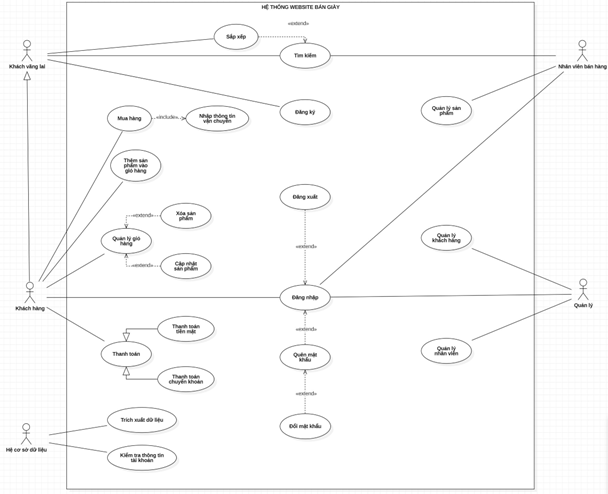
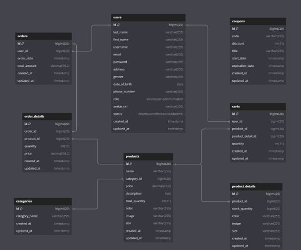

### How to Run the Server

Follow these steps to get the server up and running:

1. **Clone the Code**

    - Clone the repository containing the project code to your local machine using Git.

2. **Install Dependencies**

    - Open your command line interface (CLI).
    - Navigate to the project directory.
    - Run the command:

        ``` bash
        composer install
        ```

3. **Create Database**

    - Access your MySQL database management system (e.g., phpMyAdmin).
    - Create a new database named `shoe_store`.
    - **`Note:`** Just create database not running entire `database/database.sql` in mySQL

4. **Run Migrations**

    - In your command line interface, navigate to the project directory if you haven't already.
    - Execute the command:

        ``` bash
        php artisan migrate:refresh --seed
        ```

5. **Start the Server**

    - While still in the project directory in your command line interface, run:

        ``` bash
        php artisan serve
        ```

**`Note:`** Only do `step 3` and `step 4` for the first time you run the server.

By following these steps, your Laravel application should now be up and running locally. You can access it through your web browser at the URL provided by the `php artisan serve` command.

### Use-Case Diagram



### Class Diagram



### ERD


